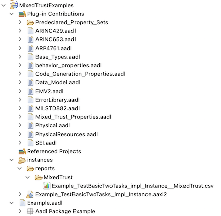
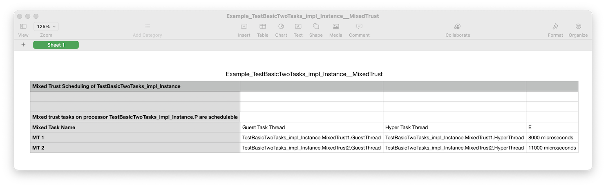

<!--
Copyright (c) 2004-2021 Carnegie Mellon University and others. (see Contributors file). 
All Rights Reserved.

NO WARRANTY. ALL MATERIAL IS FURNISHED ON AN "AS-IS" BASIS. CARNEGIE MELLON UNIVERSITY MAKES NO WARRANTIES OF ANY
KIND, EITHER EXPRESSED OR IMPLIED, AS TO ANY MATTER INCLUDING, BUT NOT LIMITED TO, WARRANTY OF FITNESS FOR PURPOSE
OR MERCHANTABILITY, EXCLUSIVITY, OR RESULTS OBTAINED FROM USE OF THE MATERIAL. CARNEGIE MELLON UNIVERSITY DOES NOT
MAKE ANY WARRANTY OF ANY KIND WITH RESPECT TO FREEDOM FROM PATENT, TRADEMARK, OR COPYRIGHT INFRINGEMENT.

This program and the accompanying materials are made available under the terms of the Eclipse Public License 2.0
which is available at https://www.eclipse.org/legal/epl-2.0/
SPDX-License-Identifier: EPL-2.0

Created, in part, with funding and support from the United States Government. (see Acknowledgments file).

This program includes and/or can make use of certain third party source code, object code, documentation and other
files ("Third Party Software"). The Third Party Software that is used by this program is dependent upon your system
configuration. By using this program, You agree to comply with any and all relevant Third Party Software terms and
conditions contained in any such Third Party Software or separate license file distributed with such Third Party
Software. The parties who own the Third Party Software ("Third Party Licensors") are intended third party benefici-
aries to this license with respect to the terms applicable to their Third Party Software. Third Party Software li-
censes only apply to the Third Party Software and not any other portion of this program or this program as a whole.
-->
# Mixed Trust Scheduling

[TOC levels=2-4 bullet hierarchy]

This Mixed Trust Scheduling analysis attempts to schedule threads using the scheduling analysis described in ["Mixed-Trust Computing for Real-Time Systems"](https://ieeexplore.ieee.org/document/8864566/).  The analysis makes use of properties declared in the property set `Mixed_Trust_Properties` to describe the relationships among processors, guest operating systems, hypervisors, and mixed trust tasks.  The plug in provides the property set `Mixed_Trust_Properties` to the OSATE workspace; it can be found under the `Plug-in Contribuitions` heading inside an AADL project.  See the figure below.



## Running the Analysis

The analysis can be run over multiple models at the same time:

1. Select one or more working sets, projects, directories, or instance model `.aaxl` files in the `AADL Navigator`. 
2. Select `Analyses > Budget > Mixed Trust Scheduling` from the menu bar or navigator context menu.

The analysis finds all the instance models (`.aaxl` files) in the selected items and runs over each one.

*  _The analysis runs for each system operation mode in each model._  
* An output comma-separated-values (`.csv`) file is generated for each analyzed model.  The file is located in the `reports/MixedTrust` folder.  The file has the same name as the model file, but with `__MixedTrust` appended to the end.  (See in the example project above.)
* If the analysis finds inconsistencies, it will produce error or warning markers on the instance model file.  These errors and warnings are also described in the .CSV files.


## Using the Analysis

The analysis finds each processor in the instance model that is marked as a mixed trust processor (see below).  It then finds all the declared mixed trust tasks (see below) bound to each mixed trust processor.  The scheduling analysis is run for each mixed trust processor to determine if the tasks on that processor are schedulable, and if so, it reports the *E* value for each mixed trust task.

### Specfiying Mixed Trust Processors

A processor is declared to be a mixed trust processor by associating the processor with the property `Mixed_Trust_Properties::Mixed_Trust_Processor`.  The value of this property is a record of type of `Mixed_Trust_Properties::Mixed_Trust_Bindings`:

```
	Mixed_Trust_Bindings: type record (
		GuestOS: reference (virtual processor);
		HyperVisor: reference (virtual processor);
	);
```

Basically, the concepts of *guest operating system* and *hypervisor* are modeled by binding virtual processors to the processor.  This record value is used to declare which virtual processor is the guest operating system and which is the hypervisor.  The analysis generates error markers if

* both fields are not set.  (AADL semantics do not require this, but the analysis needs both values.)

* The referenced virtual processors are not *bound* to the processor to which the `Mixed_Trust_Processor` property is associated.

Here *bound* means an AADL binding either through an `Actual_Processor_Binding` property assocation on the virtual propcessor or by the virtual processor being a subcomponent of the processor.  The exaples below show both ways of doing things.

#### Examples

Here we show a portion of a `system implemation` that declares a processor subcomponent to be a mixed trust processor:

```
	system implementation TestBasicTwoTasks.impl
		subcomponents
			P: processor;
			
			GuestOS: virtual processor;
			HyperVisor: virtual processor;

			// ...
						
		properties
			Actual_Processor_Binding => 
				reference(P)) applies to GuestOS, HyperVisor;			
			Mixed_Trust_Properties::Mixed_Trust_Processor => [
				GuestOS => reference(GuestOS);
				HyperVisor => reference(HyperVisor);] applies to P;

			// ...
	end TestBasicTwoTasks.impl;
```

The two main points to note are

1. The `viritual processor` subcomponents `GustOS` and `HyperVisor` are bound to the `processor` subcompnent `P` via an `Actual_Processor_Binding` property association.
2. The processor subcomponent is declare to be a mixed trust processor via the `Mixed_Trust_Processor` property association.  Furthermore, the record value of the property association declares the subcomponent `GuestOS` to be the guest operation system and the subcmponent `HyperVisor` to be the hypervisor.

Alternatively, the virtual processors could be made subcomponents of the processor:

```
	processor MixedTrustProcessor
	end MixedTrustProcessor;

	processor implementation MixedTrustProcessor.i
		subcomponents
			GuestOS: virtual processor;
			HyperVisor: virtual processor;
		properties
			Mixed_Trust_Properties::Mixed_Trust_Processor => [
				GuestOS => reference(GuestOS);
				HyperVisor => reference(HyperVisor);];
	end MixedTrustProcessor.i;

	system implementation TestBasicTwoTasks.impl2
		subcomponents
			P: processor MixedTrustProcessor.i;

			// ...
		
		properties
			// ...
	end TestBasicTwoTasks.impl2;
```

In this case, no `Actual_Processor_Binding` property assoction is required for the `virutal processor` subcompnents.  The fact that they are subcomponents of the `processor` component is enough.  The `processor` classifier has a `Mixed_Trust_Processor` property association.  This proeprty association could still be made a contained property association in the `system` implementation.  AADL provides flexibility in how models are built and expressed. 

### Specifying Mixed Trust Tasks

A mixed trust task is made up of two threads: 

1. A thread that executes on the guest operation system.
2. A thread that executes on the hypervisor.

The overall mixed trust task has its own period, deadline, and *E* value.    The *E* value is actually calculated by the scheduling algorithm, so it is not required to be specified in the model. 

Mixed trust tasks are declared by a `Mixed_Trust_Properties::Mixed_Trust_Tasks` property association on the `system` component whose containment hierarchy contains the mixed the processor and the individual thread components.  The value of the property is a list of `Mixed_Trust_Task` records:

```
	Mixed_Trust_Task: type record (
		-- A task name to improve readability of the results
		Name: aadlstring;
		
		-- Period of the mixed trust task.  Periods of the referenced Guest and Hyper task threads should not be set
		Period: Time;
		-- Deadline of the mixed trust task.  Periods of the referenced Guest and Hyper task threads should not be set
		Deadline: Time;
		
		-- The Guest and Hyper task threads should be bound to different virtual processors representing
		-- the guest OS and hypervisor environments.  These virtual processors, in turn, must be bound to the
		-- physical processor;  
		
		-- Reference to the guest task thread.  Thread should only be referenced by a single mixed trust task
		GuestTask: reference (Thread);
		-- Reference to the hyper task thread.  Thread should only be referenced by a single mixed trust task
		HyperTask: reference (Thread);	
		
		-- The "E" Value of the mixed trust task.  Effectively the deadline of the guest task, but also
		-- duration of the time used in the hypervisor used to activate the hypertask if the guest task
		-- does not meet its deadline.
		E: Time;
	);
```

The `name` field is optional, but it helps to provide a human-readable name in the output of the analysis.  The `period` and `deadline` fields declare the period and deadline of the overall mixed trust task.  These values must be specified; the analysis generates error markers if they are not.  Fields `GuestTask` and `HyperTask` reference thread components that are the guest operation system task and hypervisor task, respecitively.  Finally, `E` allows the *E* value to be annoted on the model.  Again, this value is calculated by the analysis—any specified value is ignored.  Currently the calculated value must be hand copied into the model.

#### More About Threads

The threads referenced by `GuestTask` and `HyperTask` must be bound to the correct virtual processors representing the guest operating system and hypervisor.  Again, by *bound* it is meant that thread components must have `Actual_Processor_Binding` property associations.  Furthermore, 

* The thread referenced by `GuestTask` must be bound to a virtual procoessor that is named as a `GuestOS` in a `Mixed_Trust_Processor` property association.  An error marker is generated otherwise.
* The thread referenced by `HyperTask` must be bound to a virtual procoessor that is named as a `HyperVisor` in a `Mixed_Trust_Processor` property association.  An error marker is generated otherwise.
* The two virtual processors must be bound to the same physical processor.  That is, the two threads making up the mixed trust task cannot be bound to different mixed trust processors: an error marker is generated if this is the case.

Each thread is expected to have a `Compute_Execution_Time` property association.  An error marker is generated if it does not.  This propety value is a range; the scheduler uses the maximum value.

Normally in AADL a thread is expected to have property associations for `Period` and `Deadline`.  In this case, however, the period and deadline are taken from the `Mixed_Trust_Task` record.  The analysis outputs warnings indicating that these values are not used when threads have period and deadline values.

#### Examples

In this example we use a `MixedTrustTask` `process` classifier to organize the parts of a mixed trust task.  This is not required by the analysis; it is merely an example of how the tasks may be structured.  There is currently no requirement that the `thread` for the guest operationg task and the `thread` for the hypervisor task are even in the same `process`.  The example has two mixed trust thread tasks `MixedTrust1` and `MixedTrust2` as subcomponents of the system implementation.

```
	process implementation MixedTrustTask.basicMTT
		subcomponents
			GuestThread: thread;
			HyperThread: thread;
	end MixedTrustTask.basicMTT;
	
	system implementation TestBasicTwoTasks.impl
		subcomponents
			P: processor;
			
			GuestOS: virtual processor;
			HyperVisor: virtual processor;

			MixedTrust1: process MixedTrustTask.k1;
			MixedTrust2: process MixedTrustTask.k2;
			
		properties
			// ...

			Actual_Processor_Binding => (reference(GuestOS))
				applies to MixedTrust1.GuestThread, MixedTrust2.GuestThread;
			Actual_Processor_Binding => (reference(HyperVisor))
				applies to MixedTrust1.HyperThread, MixedTrust2.HyperThread;
			
			Mixed_Trust_Properties::Mixed_Trust_Tasks => (
				[Name => "MT 1";
				 Period => 8 ms;
				 Deadline => 8 ms;
				 GuestTask => reference(MixedTrust1.GuestThread);
				 HyperTask => reference(MixedTrust1.HyperThread);],
				[Name => "MT 2"; 
				 Period => 14 ms;
				 Deadline => 14 ms;
				 GuestTask => reference(MixedTrust2.GuestThread);
				 HyperTask => reference(MixedTrust2.HyperThread);]
			);	
	end TestBasicTwoTasks.impl;

	process implementation MixedTrustTask.k1
		subcomponents
			GuestThread: thread {
				Compute_Execution_Time => 4ms .. 4ms;
			};
			HyperThread: thread {
				Compute_Execution_Time => 0ms .. 0ms;
			};
	end MixedTrustTask.k1;
	
	process implementation MixedTrustTask.k2
		subcomponents
			GuestThread: thread {
				Compute_Execution_Time => 2ms .. 2ms;
			};
			HyperThread: thread {
				Compute_Execution_Time => 3ms .. 3ms;
			};
	end MixedTrustTask.k2;
```

The important parts in this exampe are

1. The binding of the `GuestThread` subcopmonents of the mixed trust tasks to the guest operating system virtual processor `GuestOS` using an`Actual_Processor_Binding` property association.
2. The binding of the `HyperThread` subcopmonents of the mixed trust tasks to the hypervisor virtual processor `HyperVisor` using an`Actual_Processor_Binding` property association.
3. The declaration of the list of mixed trust tasks in the system implementation using a `Mixed_Trust_Tasks` property assocation.  In particular, each mixed trust tasks identifies the appropriate guest os and hypervisor task threads.
4. The declaration of the task execution times via `Compute_Execution_Time` property assocations on the thread subcomponents  in the process implementation classifiers.  Note that mixed trust task `MixedTrustTask.k1 `effectively has no hypervisor task: the compute time of the hypervisor task is 0.

## The Complete Example

Here is the complete `Example` AADL package.  It has two system implementations `TestBasicTwoTasks.impl` and `TestBasicTwoTasks.impl2`:

* The first explicitly binds `virtual processor` subcompnents to a sibling `processor` subcomponent.
* The second uses a `procoessor` classifier that declares `virtual processor` subcomponents.
* The same tasks are declared in both cases.

The AADL package file can be found [here](aadl/Example.aadl),

```
package Example
public
	with Mixed_Trust_Properties;

	process MixedTrustTask
	end MixedTrustTask;
	
	process implementation MixedTrustTask.basicMTT
		subcomponents
			GuestThread: thread;
			HyperThread: thread;
	end MixedTrustTask.basicMTT;
	
	-- ================================================================================
	
	system TestBasicTwoTasks
	end TestBasicTwoTasks;
	
	system implementation TestBasicTwoTasks.impl
		subcomponents
			P: processor;
			
			GuestOS: virtual processor;
			HyperVisor: virtual processor;

			MixedTrust1: process MixedTrustTask.k1;
			MixedTrust2: process MixedTrustTask.k2;
			
		properties
			Actual_Processor_Binding => (reference(P)) applies to GuestOS, HyperVisor;			
			Mixed_Trust_Properties::Mixed_Trust_Processor => [GuestOS => reference(GuestOS); HyperVisor => reference(HyperVisor);] applies to P;

			Actual_Processor_Binding => (reference(GuestOS)) applies to MixedTrust1.GuestThread, MixedTrust2.GuestThread;
			Actual_Processor_Binding => (reference(HyperVisor)) applies to MixedTrust1.HyperThread, MixedTrust2.HyperThread;
			
			Mixed_Trust_Properties::Mixed_Trust_Tasks => (
				[Name => "MT 1"; Period => 8 ms; Deadline => 8 ms; GuestTask => reference(MixedTrust1.GuestThread); HyperTask => reference(MixedTrust1.HyperThread);],
				[Name => "MT 2"; Period => 14 ms; Deadline => 14 ms; GuestTask => reference(MixedTrust2.GuestThread); HyperTask => reference(MixedTrust2.HyperThread);]
			);	
	end TestBasicTwoTasks.impl;

	process implementation MixedTrustTask.k1
		subcomponents
			GuestThread: thread {
				Compute_Execution_Time => 4ms .. 4ms;
			};
			HyperThread: thread {
				Compute_Execution_Time => 0ms .. 0ms;
			};
	end MixedTrustTask.k1;
	
	process implementation MixedTrustTask.k2
		subcomponents
			GuestThread: thread {
				Compute_Execution_Time => 2ms .. 2ms;
			};
			HyperThread: thread {
				Compute_Execution_Time => 3ms .. 3ms;
			};
	end MixedTrustTask.k2;

	-- ================================================================================

	processor MixedTrustProcessor
	end MixedTrustProcessor;

	processor implementation MixedTrustProcessor.i
		subcomponents
			GuestOS: virtual processor;
			HyperVisor: virtual processor;
		properties
			Mixed_Trust_Properties::Mixed_Trust_Processor => [GuestOS => reference(GuestOS); HyperVisor => reference(HyperVisor);];
	end MixedTrustProcessor.i;

	system implementation TestBasicTwoTasks.impl2
		subcomponents
			P: processor MixedTrustProcessor.i;

			MixedTrust1: process MixedTrustTask.k1;
			MixedTrust2: process MixedTrustTask.k2;
			
		properties
			Actual_Processor_Binding => (reference(P.GuestOS)) applies to MixedTrust1.GuestThread, MixedTrust2.GuestThread;
			Actual_Processor_Binding => (reference(P.HyperVisor)) applies to MixedTrust1.HyperThread, MixedTrust2.HyperThread;
			
			Mixed_Trust_Properties::Mixed_Trust_Tasks => (
				[Name => "MT 1"; Period => 8 ms; Deadline => 8 ms; GuestTask => reference(MixedTrust1.GuestThread); HyperTask => reference(MixedTrust1.HyperThread);],
				[Name => "MT 2"; Period => 14 ms; Deadline => 14 ms; GuestTask => reference(MixedTrust2.GuestThread); HyperTask => reference(MixedTrust2.HyperThread);]
			);	
	end TestBasicTwoTasks.impl2;

end Example;
```

## The CSV File

For each analyzed model, a comma-separated-values (`.csv`) file is generated in the `reports/MixedTrust` folder.  The file has the same name as the model file, but with `__MixedTrust` appended to the end.

The content is organized in a top-down manner, sorted in the following order

1. System operation modes (if any).  Any errors and warnings are output at this level.
2. Physical `processor` components that are identified as mixed trust processors.  For each processor, first it is output whether the tasks are schedulable.  If so, then a table of the tasks follows, one row for each mixed trust task.  The columns from left to right are 
	* The name of the mixed trust task, taken from the `name` field of the Mixed_Trust_Task record.
	* The component path of the thread that is the guest operation system task
	* The componnt path of the thread that is the hypervisor task.
	* The *E* value of the mixed trust task as computed by the scheduling alogrithm.

### Example

The image below shows the contents of the CSV file that is generated when the system instance for `TestBasicTwoTasks.impl` (above) is analyzed.



## Invoking Programmatically

The analysis can be invoked programmatically by other tools by calling the method

```
        AnalysisResult invoke(IProgressMonitor, SystemInstance)
```

on an instance of the class `MixedTrustAnalysis` in the package `org.osate.analysis.mixedtrust.analysis`.  This is found in the plug-in `org.osate.analysis.mixedtrust.analysis`.

As the signature indicates, the method takes a possibly `null` progress monitor, and the `SystemInstance` object of the model to analyze.  All the system operation modes of the model are analyzed.

A new instance of the class `MixedTrustAnalysis` should be used for each system instance.   

### Result format

The format for the `AnalysisResult` tree returned by `invoke()` is as follows: 

`AnalysisResult`

* `analysis` = "Mixed Trust Scheduling"
* `modelElement` = `SystemInstance` being analyzed
* `resultType` = `SUCCESS`
* `message` = "Mixed Trust Scheduling of _name of system instance_"`
* `diagnostics` = _empty list_
* `parameters` = _empty list_
* `results` = one `Result` for each system operation mode

    * `modelElement` = `SystemOperationMode` instance object
    * `resultType` = `SUCCESS`
    * `message` = `""` if the SOM is `null` or the empty som, otherwise `"(xxx, ..., yyy)"`
    * `values` = _empty list_
    * `diagnostics` = Diagnostics for the state of the system in the system operation mode.
    * `subResults` = one `Result` for each `ComponentInstance` with `category` of `Processor` that has a consistent property association for `Mixed_Trust_Processor`'
    
        * `modelElement` = `ComponentInstance` instance object
        * `resultType` = `SUCCESS`
        * `message` = The component path of the processor
        * `values[0]` = Whether the processor's tasks are schedulable (`BooleanValue`)
        * `diagnostics` =  _empty list_
        * `subResults` = one `Result` for each mixed trust task that is bound to the processor via a `Mixed_Trust_Tasks` property association.  Results are in the order that the `Mixed_Trust_Task` records appear in the list associated with the property.  The `subResults` list only exists if the tasks are schedulable.

            * `modelElement` = The Aadl EMF PropertyValue object that corresponds to the task record property value
            * `resultType` = `SUCCESS`
            * `message` = name of the mixed trust task as taken from the `name` field of the record
            * `values[0]` = The *E* value for the mixed trust task in microseconds (`IntegerValue`)
            * `values[1]` = The component path of the mixed trust task's guest task thread (`StringValue`)
            * `values[2]` = The component path of the mixed trust task's hyper task thread (`StringValue`)
            * `diagnostics` =  _empty list_
            * `subResults` = _empty list_
